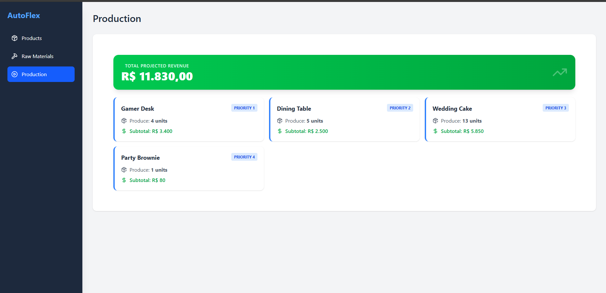
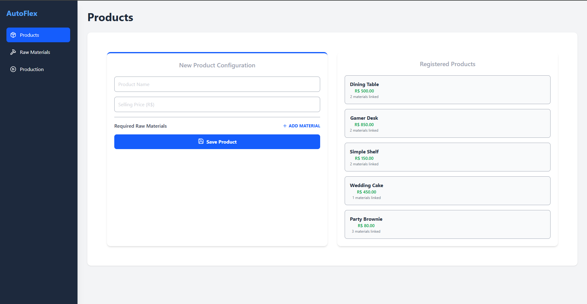
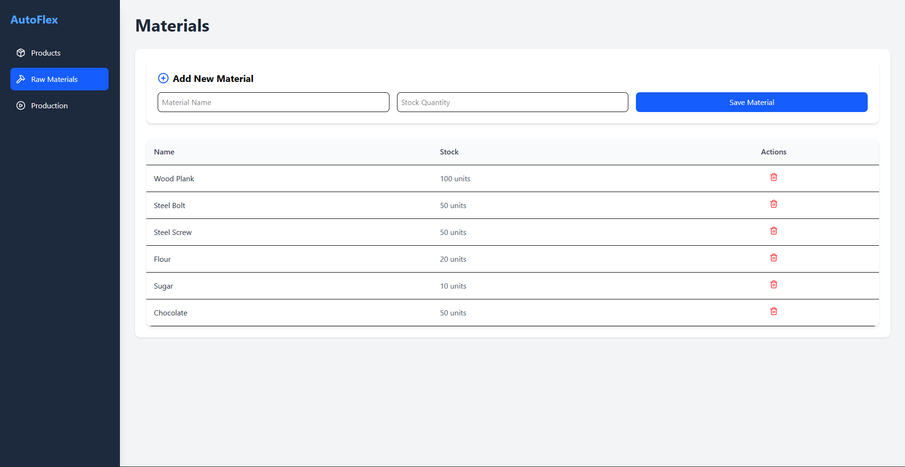

# Inventory & Production Management System 🚀

A full-stack application designed to manage raw materials and product inventory for a manufacturing industry. The system calculates the optimal production plan based on available stock, prioritizing products with higher market value.





## 🛠 Technologies

### Backend

- **Java 17+**
- **Spring Boot 4.0+**
- **Spring Data JPA**
- **Hibernate 7.x**
- **PostgreSQL**

### Frontend

- **React** (Vite)
- **Redux Toolkit**
- **Tailwind CSS**
- **Axios**
- **Lucide-React**

### Database

- **PostgreSQL** (Port 5432)

## 📌 Features

- **Raw Material Management (CRUD)** - Maintain records of materials and their stock quantities
- **Product Management (CRUD)** - Manage products with price and technical specifications
- **Material-Product Association** - Define which materials and quantities are needed for each product
- **Production Suggestion Algorithm** - A greedy algorithm that analyzes current stock and suggests the maximum production possible, prioritizing high-value items first to maximize revenue

## 🚀 How to Run

### 1. Prerequisites

- JDK 17 or higher
- Node.js (v18+)
- PostgreSQL running on port 5432

### 2. Backend Setup

1. Clone the repository
2. Navigate to the backend folder
3. Configure your database credentials in `src/main/resources/application.properties`:

   ```properties
   spring.datasource.url=jdbc:postgresql://localhost:5432/inventory_db
   spring.datasource.username=your_username
   spring.datasource.password=your_password
   spring.datasource.driver-class-name=org.postgresql.Driver
   spring.jpa.database-platform=org.hibernate.dialect.PostgreSQLDialect
   spring.jpa.hibernate.ddl-auto=update
   ```

4. Run the application:
   ```bash
   ./mvnw spring-boot:run
   ```
   The backend will be available at `http://localhost:8080`

### 3. Frontend Setup

1. Navigate to the frontend folder
2. Install dependencies:
   ```bash
   npm install
   ```
3. Start the development server:
   ```bash
   npm run dev
   ```
4. Access the system at `http://localhost:5173`

## 🔌 API Endpoints

| Method | Endpoint                     | Description                            |
| ------ | ---------------------------- | -------------------------------------- |
| GET    | `/api/materials`             | List all raw materials                 |
| POST   | `/api/materials`             | Create a new material                  |
| GET    | `/api/products`              | List all products with their materials |
| POST   | `/api/products`              | Create a product and its associations  |
| GET    | `/api/production/suggestion` | Get the prioritized production plan    |

## 📐 Project Structure

The project follows a clean separation of concerns:

### Backend Architecture

```
src/main/java/com/example/demo/
├── controller/          # REST endpoints
├── service/             # Business logic
├── repository/          # Data access layer
├── entity/              # Database models
└── dto/                 # Data transfer objects
```

- **Controllers**: Handle HTTP requests and responses
- **Services**: Implement business logic and algorithms
- **Repositories**: Manage database operations (Spring Data JPA)
- **Entities**: JPA entities representing database tables
- **DTOs**: Data structures for API communication

### Frontend Structure

- **Redux Toolkit**: Global state management for materials, products, and production data
- **Components**: Reusable React components for CRUD operations
- **Tailwind CSS**: Utility-first CSS for fully responsive UI
